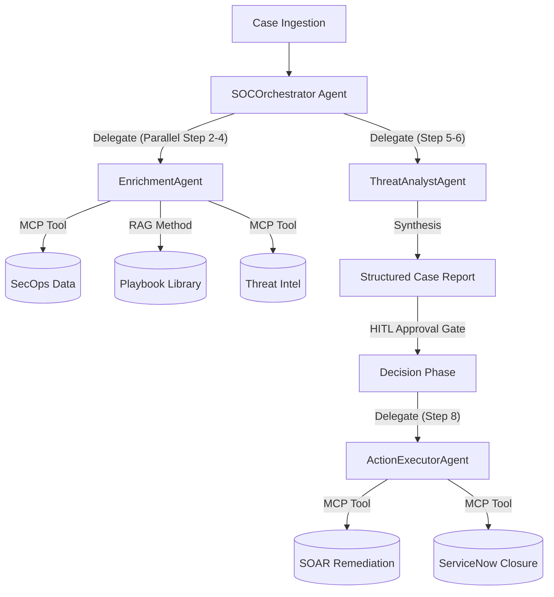

# 🛡️ Agentic SecOps: Executive Solution Overview
**Agentic AIOps Platform · Powered by Gemini 2.0 & Google ADK**

---

## 🏗️ 1. Architecture: The Agentic Core
Agentic SecOps is built on a **Hybrid Agentic Architecture** that combines three core Google/Industry standards to automate the Security Operations Center (SOC).

### Key Pillars:
- **Google ADK (Agent Development Kit)**: Orchestrates the hand-offs between specialized AI agents.
- **RAG (Retrieval-Augmented Generation)**: Grounding the AI's recommendations in your company's official security playbooks.
- **MCP (Model Context Protocol)**: Standardized way for agents to "talk" to your existing security tools (GTI, ServiceNow, SIEM).

---

## 🚀 2. The 9-Step Agentic Pipeline
We have optimized the traditional SOC workflow into a high-performance, parallelized 9-step process.

| Step | Phase | Agent In-Charge | Description |
| :--- | :--- | :--- | :--- |
| **1** | **Ingestion** | Orchestrator | Case is received from SIEM (e.g. Google SecOps). |
| **2** | **Data Retrieval** | Enrichment | **Parallel**: Fetching raw logs, user data, and affected assets via MCP. |
| **3** | **Playbook RAG** | Enrichment | **Parallel**: Semantic search to find the correct procedure in the library. |
| **4** | **Threat Intel** | Enrichment | **Parallel**: Enriching IPs/Domains/Hashes via GTI (Google Threat Intel). |
| **5** | **Synthesis** | Analysis | Gemini reasons across all data to generate the Impact Assessment. |
| **6** | **Recommendation** | Analysis | Identifies the optimal Playbook and specific action steps. |
| **7** | **HITL Approval** | Orchestrator | Pauses for human review (unless Auto-Remediation is triggered). |
| **8** | **Action Execution**| Action Executor | Performs remediation (e.g. blocking IPs) via SOAR tools. |
| **9** | **Case Closure** | Orchestrator | Updates ServiceNow and generates the final audit trail. |

---

## 🧪 3. Demo Walkthrough: CASE-001 (Lateral Movement)
*Demonstrating how the principles come together for a Critical Case.*

### 📂 Phase A: Detection & Parallel Enrichment (Steps 1-4)
- **Problem**: Compromised domain admin account accessing 14 workstations sequentially.
- **The Agentic Move**: Instead of 3 separate API calls, the `EnrichmentAgent` triggers one **Parallel Enrichment** turn.
  - **MCP (Data)**: Pulls logs showing the lateral movement originated from a phishing link.
  - **RAG (Knowledge)**: Matches the threat to **PB-003 (Credential Compromise Response)** with 92% relevance.
  - **MCP (Intel)**: Flags the attacker's C2 IP as "Malicious" via GTI.

### 🧠 Phase B: AI Threat Synthesis (Steps 5-6)
- **Analysis**: Gemini reconciles the raw logs with the Intel and identifies the specific Domain Admin user (`j.smith`).
- **Blast Radius**: Identifies **14 machines** effectively communicating with the rogue domain.
- **Recommendation**: Gemini recommends execution of **PB-003**.

### ✅ Phase C: HITL & Execution (Steps 7-8)
- **Human Decision**: Because it's **CRITICAL**, the orchestrator pauses. The analyst clicks "✅ Accept Recommendation."
- **ActionExecutor**: Resumes the pipeline and isolates host `WKS-RES-042` via EDR, suspends user `j.smith`, and blocks the IP at the firewall.

---

## 📈 4. Key Benefits for the Client
- **90% Latency Reduction**: No more waiting for agents to run sequentially. Steps 2, 3, and 4 happen at once in a single 'Parallel Enrichment' turn.
- **Model Agnostic**: UI and logic use the `ThreatAnalystAgent` persona, allowing you to swap models (Gemini, Vertex AI, etc.) without UI disruption.
- **Zero Re-Analysis Loops**: Direct handover from HITL to Execution ensures the agent never asks "Wait, what happened?" after you approve.
- **Auto-Remediation**: Low/Medium cases can move from Ingestion to Execution in seconds.

> [!TIP]
> **Production Readiness**: Every mock tool in this POC is built on the **Adapter Pattern**, meaning you can swap "Mocks" for "Production APIs" without rewriting any code.
