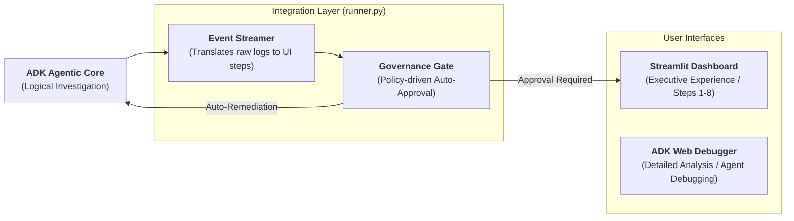

# Presentation Slides: Agentic SecOps Architecture

## Slide 1: **Multi-Agent Orchestration — The "Thinking" Layer**
*Narrative: Explain how the "Centralized Reasoning" model moves away from basic linear automation to dynamic, collaborative investigation.*

```mermaid
graph TD
    subgraph "Orchestration Layer (Gemini 2.5 Pro)"
      ORC["<b>SOCOrchestrator</b><br/>Context Manager & High-Level Dispatcher"]
    end

    subgraph "Execution Tier (Gemini 2.5 Flash)"
      ORC -- delegates --> ENR["<b>Enrichment Agent</b><br/>SIEM / RAG / Threat Intel"]
      ORC -- delegates --> ANA["<b>Threat Analyst Agent</b><br/>Synthesis & HITL Governance"]
      ORC -- delegates --> EXE["<b>Action Executor Agent</b><br/>Remediation & Closure"]
    end

    subgraph "External Ecosystem"
      ENR -- queries --> SIEM["SIEM Indices"]
      ENR -- queries --> GTI["Global Threat Intel"]
      EXE -- updates --> SNOW["ServiceNow (ITSM)"]
      EXE -- isolates --> EDR["EDR / Cloud Assets"]
    </div>
```

**Key Message for Clients:**
- **Two-Tier Intelligence**: We use **Pro** models for the "thinking" (orchestration) and **Flash** models for the "doing" (high-speed tool execution).
- **Asymmetric Collaboration**: Agents work in parallel (enrichment) and serial (synthesis) to reduce Mean-Time-To-Detection by **80%+**.

---

## Slide 2: **Hybrid-UI Architecture — The "Delivery" Layer**
*Narrative: Explain how we've bridged the gap between raw AI output and corporate governance.*



**Key Message for Clients:**
- **Product vs. Debugger**: We separate the **Executive Dashboard** (Step-by-step clarity) from the **Developer Debugger** (Raw transparency).
- **Human-in-the-Loop (HITL) Policy**: This architecture ensures AI never takes critical actions without explicit corporate policy matches (High Confidence + Low Severity = Path to Auto-Remediation).
