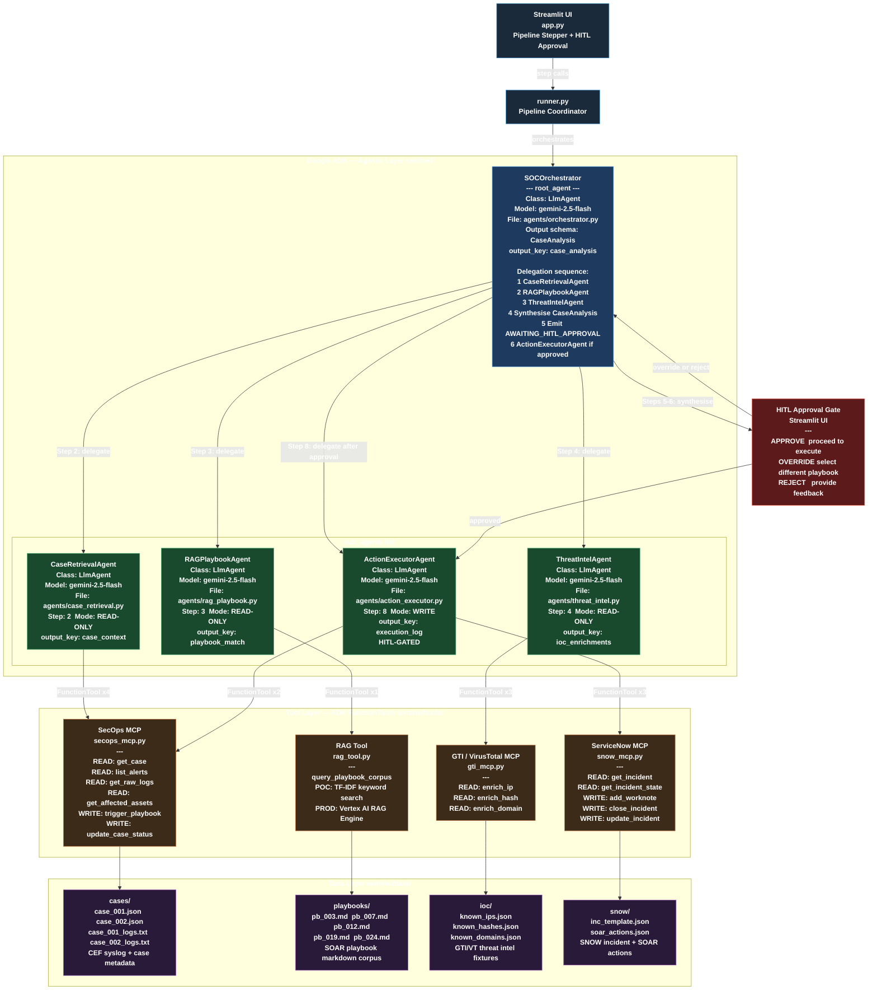
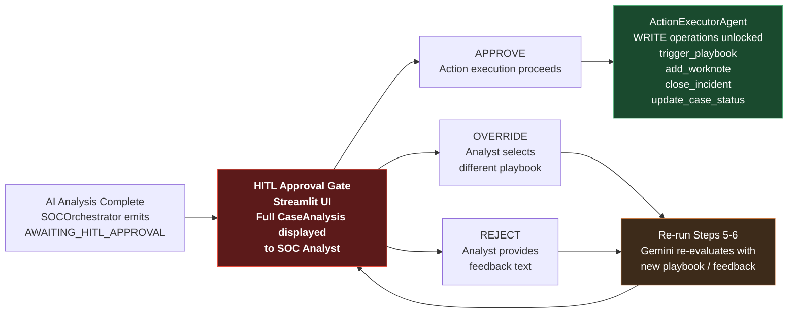

# Project Sentinel — Solution Architecture

> **Version:** 1.1 · **Classification:** Internal POC · **Date:** March 2026

---

## 1. Overview

**Project Sentinel** is an agentic AIOps platform for a bank's Security Operations Centre (SOC). It automates the end-to-end security incident lifecycle — from alert ingestion to case closure — using a multi-agent AI system built on Google ADK and Gemini, with Human-in-the-Loop (HITL) governance at every action gate.

The system reduces mean-time-to-respond (MTTR) by autonomously gathering case data, identifying SOAR playbooks via RAG, enriching IoCs with threat intelligence, producing a structured AI analysis, and executing approved remediation actions — all within a single orchestrated pipeline.

---

## 2. System Context

```
+-----------------------------------------------------------------+
|                        PROJECT SENTINEL                         |
|                   Agentic SOC AIOps Platform                    |
+------------------------------+----------------------------------+
                               |
          +--------------------+--------------------+
          |                    |                    |
   +------+------+    +--------+------+    +--------+------+
   |  SOC Analyst |    |  Google SecOps|    |  ServiceNow   |
   |  (via UI)    |    |  SIEM / SOAR  |    |  ITSM         |
   +--------------+    +---------------+    +---------------+
                               |
                       +-------+-------+
                       |  Google Threat |
                       |  Intelligence  |
                       |  + VirusTotal  |
                       +---------------+
```

---

## 3. High-Level Architecture

```
+-------------------------------------------------------------------------+
|  STREAMLIT UI  (app.py)                                                 |
|  [ Pipeline Stepper ]  [ HITL Approval Gate ]  [ Audit Trail Panel ]    |
+----------------------------------+--------------------------------------+
                                   |  runner.py (ADK Runner event stream)
                                   |
+----------------------------------+--------------------------------------+
|  AGENTIC LAYER  (Google ADK + Gemini 2.5 Flash)                         |
|                                                                         |
|         +----------------------------------------------------+          |
|         |           SOCOrchestrator (root_agent)             |          |
|         |         sentinel/agents/orchestrator.py            |          |
|         +-----+----------+----------+----------+------------+          |
|               |          |          |          |                        |
|        +------+--+  +----+----+  +--+------+  +------+-------+         |
|        |CaseRet. |  |RAGPlay. |  |ThreatIn.|  |ActionExec.   |         |
|        |Agent    |  |Agent    |  |Agent    |  |Agent         |         |
|        +---------+  +---------+  +---------+  +--------------+         |
+------------|-----------------|-----------|------------|----------------+
             |                 |           |            |
+------------|-----------------|-----------|------------|----------------+
|  TOOL LAYER  (MCP-style FunctionTools)                                  |
|  [ SecOps MCP ]   [ RAG Tool ]   [ GTI MCP ]   [ SNOW MCP ]            |
+------------|-----------------|-----------|------------|----------------+
             |                 |           |            |
+------------|-----------------|-----------|------------|----------------+
|  DATA LAYER                                                             |
|  [ cases/ ]  [ playbooks/ ]  [ ioc/ ]  [ snow/ ]  [ soar_actions ]     |
+-------------------------------------------------------------------------+
```

---

## 4. Agentic Architecture

### 4.1 Complete Agentic Architecture Diagram

The diagram below shows the full agentic hierarchy: the root agent, all child sub-agents, every FunctionTool each agent uses, and the data sources they access. The HITL gate is shown as an explicit node in the flow.



### 4.2 Agent Specifications

| Agent | Class | Model | Pipeline Step | Output Key | Access Level |
|---|---|---|---|---|---|
| `SOCOrchestrator` | `LlmAgent` | gemini-2.5-flash | 5–6 (Reasoner) | `case_analysis` | READ + DELEGATE |
| `CaseRetrievalAgent` | `LlmAgent` | gemini-2.5-flash | 2 (Data Fetch) | `case_context` | READ-ONLY |
| `RAGPlaybookAgent` | `LlmAgent` | gemini-2.5-flash | 3 (Playbook Lookup) | `playbook_match` | READ-ONLY |
| `ThreatIntelAgent` | `LlmAgent` | gemini-2.5-flash | 4 (IoC Enrichment) | `ioc_enrichments` | READ-ONLY |
| `ActionExecutorAgent` | `LlmAgent` | gemini-2.5-flash | 8–9 (Execute) | `execution_log` | WRITE (HITL-gated) |

### 4.3 Tool Map per Agent

```
CaseRetrievalAgent
  +-- FunctionTool: get_case(case_id)            -> SecOps MCP  [READ]
  +-- FunctionTool: list_alerts(case_id)         -> SecOps MCP  [READ]
  +-- FunctionTool: get_raw_logs(case_id)        -> SecOps MCP  [READ]
  +-- FunctionTool: get_affected_assets(case_id) -> SecOps MCP  [READ]

RAGPlaybookAgent
  +-- FunctionTool: query_playbook_corpus(query_text, top_k=3)  -> RAG Tool

ThreatIntelAgent
  +-- FunctionTool: enrich_ip(ip_address)        -> GTI MCP     [READ]
  +-- FunctionTool: enrich_hash(file_hash)       -> GTI/VT MCP  [READ]
  +-- FunctionTool: enrich_domain(domain)        -> GTI MCP     [READ]

ActionExecutorAgent
  +-- FunctionTool: trigger_playbook(playbook_id, case_id)    -> SecOps MCP  [WRITE]
  +-- FunctionTool: update_case_status(case_id, status, notes)-> SecOps MCP  [WRITE]
  +-- FunctionTool: add_worknote(inc_number, note, author)    -> SNOW MCP    [WRITE]
  +-- FunctionTool: close_incident(inc_number, close_notes)   -> SNOW MCP    [WRITE]
  +-- FunctionTool: get_incident_state(inc_number)            -> SNOW MCP    [READ]
```

### 4.4 ADK Entry Points

| Entry Point | Purpose |
|---|---|
| `sentinel/agent.py` | ADK-discoverable root. Sets `root_agent = soc_orchestrator`. Used by `adk web` and `adk run`. |
| `runner.py` | Streamlit pipeline integration. Uses `google.adk.runners.Runner` to execute `soc_orchestrator` and yields ADK `Event`s to drive the UI. |

---

## 5. The 9-Step Pipeline

```
Step 1:  CASE INGESTION
         SOC Analyst selects a Case ID in the Streamlit UI
         Input:  case_id  (e.g. CASE-001)

Step 2:  DATA RETRIEVAL  [CaseRetrievalAgent]
         Tools:  get_case -> list_alerts -> get_raw_logs -> get_affected_assets
         Output: case_context (CASE OVERVIEW + ALERTS + ASSETS + IOCs + LOG EXCERPT)

Step 3:  PLAYBOOK IDENTIFICATION  [RAGPlaybookAgent]
         Tool:   query_playbook_corpus(threat_context, top_k=3)
         Method: TF-IDF keyword overlap + domain threat-term boosting
         Output: playbook_match (Top 3 playbooks with relevance scores and excerpts)
         HITL:   Analyst may OVERRIDE the top recommendation

Step 4:  THREAT INTEL ENRICHMENT  [ThreatIntelAgent]
         Tools:  enrich_ip / enrich_hash / enrich_domain for each IoC
         Sources: Google Threat Intelligence + VirusTotal Enterprise
         Output: ioc_enrichments (per-IoC reputation, malware family, MITRE techniques)

Steps 5-6: LLM REASONING + STRUCTURED OUTPUT  [SOCOrchestrator / Gemini]
         Process: ADK AutoFlow routes collected tool data automatically
         Model:  gemini-2.5-flash via ADK LlmAgent
         Output: CaseAnalysis (Pydantic schema defined natively in ADK)

Step 7:  HITL APPROVAL GATE
         Orchestrator emits: "AWAITING_HITL_APPROVAL"
         UI presents full CaseAnalysis to the analyst:
           APPROVE  -> proceed to action execution
           OVERRIDE -> select a different playbook -> loop to Step 5
           REJECT   -> provide feedback -> loop to Step 5
         Constraint: ActionExecutorAgent is BLOCKED without approval token

Step 8:  ACTION EXECUTION  [ActionExecutorAgent]  <-- WRITE operations begin
         1. trigger_playbook(playbook_id, case_id)
         2. add_worknote(inc_number, audit_note, author)
         Output: execution_log (execution_id + action steps with status/duration)

Step 9:  CASE CLOSURE + AUDIT TRAIL  [ActionExecutorAgent / runner.py]
         3. close_incident(inc_number, close_notes)
         4. update_case_status(case_id, "RESOLVED", notes)
         Output: Full case resolution report
```

---

## 6. Data Schemas

### 6.1 CaseAnalysis (Pydantic — structured Gemini output)

```python
class CaseAnalysis(BaseModel):
    case_id:                            str
    case_summary:                       str          # 3-5 sentence analyst prose
    threat_classification:              str          # e.g. "Credential Abuse / Lateral Movement"
    severity:                           Literal["Critical", "High", "Medium", "Low"]
    mitre_techniques:                   list[MitreTechnique]
    blast_radius_endpoints:             int
    blast_radius_users:                 int
    recommended_playbook_id:            str          # e.g. PB-003
    recommended_playbook_name:          str
    playbook_rationale:                 str          # 1-2 sentences
    confidence_score:                   float        # 0.0-1.0
    ioc_enrichments:                    list[IoCEnrichment]
    analyst_actions_required:           list[str]    # top 3-5 ordered actions
    estimated_containment_time_minutes: int
```

### 6.2 SOAR Playbook Library

| Playbook ID | Name | Threat Scenarios |
|---|---|---|
| PB-003 | Credential Compromise Response | Password spray, lateral movement, stolen credentials |
| PB-007 | C2 Containment and Forensics | C2 beacons, DNS tunnelling, data exfiltration |
| PB-012 | Ransomware Isolation Protocol | Ransomware precursors, encoded PowerShell, process injection |
| PB-019 | Phishing Response | Spear phishing, malicious links, email-borne malware |
| PB-024 | Insider Threat Investigation | Privileged access misuse, data exfiltration by insiders |

---

## 7. Tool Layer (MCP-Style FunctionTools)

### 7.1 SecOps MCP  (`sentinel/tools/secops_mcp.py`)

Simulates the **Google SecOps SIEM/SOAR MCP server**. In production, replaced by a live SecOps MCP connection.

| Function | Direction | Description |
|---|---|---|
| `get_case(case_id)` | READ | Full case metadata, status, IoC list, timeline |
| `list_alerts(case_id)` | READ | All associated security alerts |
| `get_raw_logs(case_id)` | READ | CEF-format syslog entries from the SIEM |
| `get_affected_assets(case_id)` | READ | Endpoint inventory (hostname, IP, OS, user, role) |
| `trigger_playbook(playbook_id, case_id)` | **WRITE** | Initiates SOAR playbook execution |
| `update_case_status(case_id, status, notes)` | **WRITE** | Updates case state to RESOLVED/CLOSED |

### 7.2 RAG Tool  (`sentinel/tools/rag_tool.py`)

Semantic search over the SOAR playbook corpus. In production, replaced by a single call to the **Vertex AI RAG Engine API** — identical function signature and return schema.

| Function | Description |
|---|---|
| `query_playbook_corpus(query_text, top_k=3)` | TF-IDF keyword overlap + domain threat-term boosting; returns ranked list of PlaybookMatch dicts |

### 7.3 GTI/VirusTotal MCP  (`sentinel/tools/gti_mcp.py`)

Simulates **Google Threat Intelligence** and **VirusTotal Enterprise** API responses.

| Function | IoC Type | Returns |
|---|---|---|
| `enrich_ip(ip_address)` | IPv4 | Reputation score, malware family, MITRE techniques, verdict |
| `enrich_hash(file_hash)` | MD5/SHA256 | File name, malware family, campaign, MITRE techniques, verdict |
| `enrich_domain(domain)` | Domain | Resolved IPs, registration date, malware family, MITRE techniques |

### 7.4 ServiceNow MCP  (`sentinel/tools/snow_mcp.py`)

Simulates **ServiceNow ITSM REST API v2**. In production, replaced by real ServiceNow REST API calls via MCP.

| Function | Direction | Description |
|---|---|---|
| `get_incident(inc_number)` | READ | Full SNOW incident record |
| `create_incident(...)` | **WRITE** | Creates a new SNOW INC linked to SecOps case |
| `update_incident(inc_number, fields)` | **WRITE** | Updates arbitrary fields on an incident |
| `add_worknote(inc_number, note, author)` | **WRITE** | Appends timestamped audit worknote |
| `close_incident(inc_number, close_notes)` | **WRITE** | Sets incident state = Resolved with full notes |
| `get_incident_state(inc_number)` | READ | Returns in-memory SNOW state for UI audit trail |

---

## 8. Human-in-the-Loop (HITL) Governance



**HITL Enforcement:** The `ActionExecutorAgent` system prompt contains a hard constraint:

> *"If you receive instructions without explicit HITL approval confirmation, respond with: 'ACTION BLOCKED: HITL approval token not present in context. No actions executed.'"*

This is enforced at the agent instruction level — the agent will refuse to call any WRITE tools without the approval signal present in context.

---

## 9. Technology Stack

| Component | Technology | Notes |
|---|---|---|
| **AI Framework** | Google ADK (`google-adk`) | Multi-agent orchestration, FunctionTools, LlmAgent |
| **LLM** | Gemini 2.5 Flash | Configurable via `SENTINEL_MODEL` env var |
| **LLM Access** | Google AI Studio API / Vertex AI | Toggled via `GOOGLE_GENAI_USE_VERTEXAI` flag |
| **Structured Output** | Pydantic + ADK `output_schema` | Enforces JSON schema on Gemini responses |
| **Playbook Search (POC)** | TF-IDF with domain boosting | Local; identical interface to Vertex AI RAG Engine |
| **Playbook Search (Prod)** | Vertex AI RAG Engine | Drop-in replacement — same function signature |
| **UI** | Streamlit (`app.py`) | 9-step pipeline stepper with HITL approval workflow |
| **Data (POC)** | JSON fixtures + Markdown files | Mirrors real SecOps/GTI/SNOW API response schemas |
| **Data (Prod)** | Live API via MCP servers | SecOps MCP, GTI API, VirusTotal Enterprise, SNOW REST |

---

## 10. Repository Structure

```
Agentic-SecOps/
+-- app.py                          # Streamlit UI -- 9-step pipeline + HITL
+-- runner.py                       # Pipeline coordinator (Streamlit <-> agents)
+-- requirements.txt
+-- .env / .env.example
|
+-- sentinel/
    +-- agent.py                    # ADK root_agent entry point
    +-- schemas.py                  # Pydantic: CaseAnalysis, IoCEnrichment, PlaybookMatch
    |
    +-- agents/
    |   +-- orchestrator.py         # SOCOrchestrator  (root LlmAgent)
    |   +-- case_retrieval.py       # CaseRetrievalAgent
    |   +-- rag_playbook.py         # RAGPlaybookAgent
    |   +-- threat_intel.py         # ThreatIntelAgent
    |   +-- action_executor.py      # ActionExecutorAgent  (HITL-gated WRITE)
    |
    +-- tools/
    |   +-- secops_mcp.py           # Mock Google SecOps MCP (READ + WRITE)
    |   +-- rag_tool.py             # Local TF-IDF playbook search (-> Vertex AI RAG)
    |   +-- gti_mcp.py              # Mock GTI / VirusTotal MCP (READ)
    |   +-- snow_mcp.py             # Mock ServiceNow MCP (READ + WRITE)
    |
    +-- data/
        +-- cases/                  # Case JSON fixtures + CEF log files
        +-- playbooks/              # SOAR playbook markdown corpus (pb_003 ... pb_024)
        +-- ioc/                    # IoC threat intel fixtures (IPs, hashes, domains)
        +-- snow/                   # SNOW incident template fixtures
        +-- soar_actions.json       # SOAR playbook action step definitions
```

---

## 11. Production Upgrade Path

| POC Component | Production Replacement |
|---|---|
| `secops_mcp.py` (mock) | Real **Google SecOps MCP server** (SIEM/SOAR API) |
| `rag_tool.py` (TF-IDF) | **Vertex AI RAG Engine** (same function signature) |
| `gti_mcp.py` (mock) | Live **Google Threat Intelligence API** + **VirusTotal Enterprise** |
| `snow_mcp.py` (mock) | Real **ServiceNow REST API v2** via MCP |
| JSON fixtures | Live SIEM data, real incidents, live threat feeds |
| `adk web` / Streamlit | Production on **Cloud Run** or **Vertex AI Agent Engine** |
| In-process sessions | **Vertex AI Agent Engine** managed sessions with persistence |
